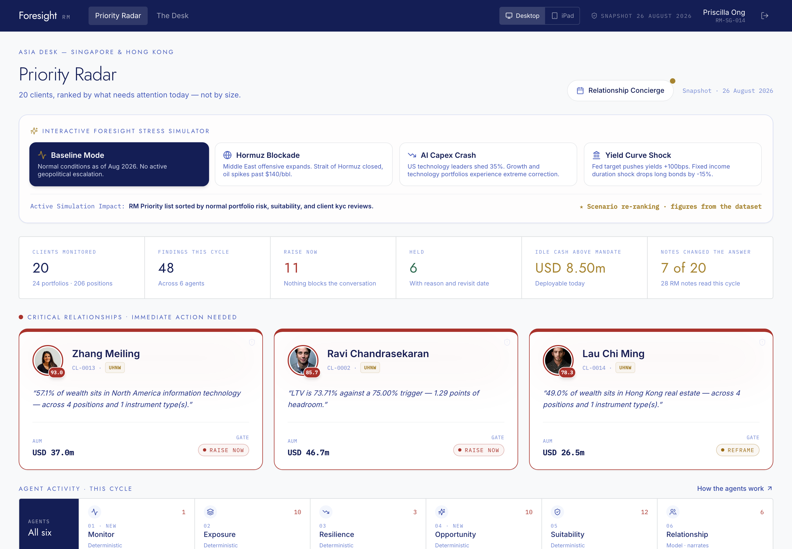

# Foresight RM — AI Wealth Management & Portfolio Risk Intelligence

**Foresight RM** is an explainable AI wealth-management platform built for relationship managers. It turns fragmented portfolio, credit, market and CRM information into prioritised, evidence-backed client conversations—without allowing an AI model to invent financial figures or send client communications autonomously.

Built for **Julius Baer SingHacks 2026**, the application helps private-bank RMs identify hidden investment risk, portfolio concentration, liquidity pressure, credit and margin exposure, suitability exceptions, and unattended client opportunities across an entire book.

**Project categories:** Explainable AI · AI wealth management · FinTech · RegTech · portfolio risk management · relationship-manager copilot · responsible AI



## Why Foresight RM

Traditional wealth-management systems assess holdings, credit facilities and relationship notes in isolation. Foresight RM connects them. It can reveal when a client's investments, pledged collateral, structured products and source of wealth represent one correlated economic bet, then supplies the evidence and client-aware wording an RM needs to handle the discussion responsibly.

**Detectors compute. AI narrates. No AI originates a number.**

## Key capabilities

- **AI-powered RM workflow:** ranks 20 clients by urgency and produces tailored meeting briefs, handover packs and client-language drafts.
- **Portfolio risk intelligence:** detects cross-portfolio concentration and look-through exposure inside structured products.
- **Credit & liquidity monitoring:** analyses Lombard loan-to-value paths, collateral shocks, margin-call proximity, gated assets and future cash needs.
- **Suitability & mandate governance:** checks allocation bands, sustainable-investment exclusions, documented waivers and missing evidence.
- **Explainable recommendations:** every finding includes source evidence; deterministic Python code calculates all metrics.
- **Human-in-the-loop AI:** the Relationship agent can hold or reframe sensitive findings, while final client communication requires RM approval and is retained in an SQLite audit trail.
- **Data-integrity safeguards:** handles real-world banking artefacts such as custody accounts, FX conventions, bond quantities, stale marks and private-market liquidity gates.

## Technology

| Layer | Stack |
| --- | --- |
| Frontend | React, TypeScript, Vite, TanStack Query |
| Backend | Python, FastAPI, pandas, Pydantic |
| AI | Structured Anthropic model calls with input-hash caching; cached responses support a no-key demo |
| Data | Synthetic banking CSVs, RM notes and SQLite approval audit trail |
| Deployment | Docker and Railway-ready single-service deployment |

## Quick start

```bash
git clone git@github.com:jvvinoth/Foresight-RM.git
cd Foresight-RM

# Terminal 1 — API
cd backend
pip install -r requirements.txt
uvicorn main:app --port 8010 --reload

# Terminal 2 — web application
cd frontend
npm install
npm run dev
```

Open [http://localhost:5173](http://localhost:5173). The FastAPI API and interactive OpenAPI documentation are available at [http://localhost:8010/docs](http://localhost:8010/docs).

For a production-style single-service build:

```bash
docker build -t foresight-rm .
docker run --rm -p 9099:9099 -e PORT=9099 foresight-rm
```

## Architecture

```text
Portfolio + credit + market + CRM data
              ↓
Deterministic risk detectors → Relationship-aware gate → AI narration → RM approval
              ↓                                              ↓
       Evidence-backed findings                         Auditable client draft
```

Five deterministic specialist detectors cover monitoring, exposure, resilience, opportunity and suitability; a relationship layer determines whether a result should be raised, reframed, held or treated as authorised. See the [end-to-end architecture diagram](docs/ARCHITECTURE.md), the [detailed component architecture](docs/DETAILED_ARCHITECTURE.md), [HANDOVER.md](HANDOVER.md) for the developer guide, [the data dictionary](docs/DATA_DICTIONARY.md) for data definitions, and run `python backend/verify.py` to reproduce headline claims from their source rows.

## Code structure

```text
Foresight-RM/
├── backend/                 # FastAPI service and wealth-intelligence engine
│   ├── agents/              # AI narration and relationship-aware context
│   │   ├── relationship.py  # RM-note context, communication constraints and vetoes
│   │   └── narrator.py      # Conversation briefs and client-language drafts
│   ├── detectors/           # Deterministic risk, resilience and suitability checks
│   │   ├── exposure.py      # Cross-portfolio and structured-product look-through
│   │   ├── resilience.py    # LTV shocks, credit and liquidity analysis
│   │   └── suitability.py   # Mandate, exclusion and waiver checks
│   ├── engine.py            # Runs, gates and ranks findings across the book
│   ├── gate.py              # Raise / reframe / hold / authorised decision logic
│   └── main.py              # API routes and static-app serving
├── frontend/                # React + TypeScript relationship-manager interface
│   └── src/                 # Application source
│       ├── pages/           # Dashboard, client, agent and integrity views
│       ├── components/      # Reusable visual and interaction components
│       └── api/             # Typed frontend API client
├── data/                    # Synthetic client, portfolio, market and CRM source data
│   ├── holdings.csv         # Position-level portfolio snapshots
│   ├── credit_facilities.csv # Lombard and term-facility history
│   └── rm_notes.json        # Relationship-manager notes
├── docs/                    # Data dictionary, pitch deck and UI screenshots
│   ├── DATA_DICTIONARY.md   # Dataset definitions and conventions
│   └── screens/             # Product screenshots used in documentation
├── Dockerfile               # Production container build
└── railway.json             # Railway deployment configuration
```

## Responsible AI notice

All client data is synthetic and supplied for the SingHacks 2026 challenge. Foresight RM is a demonstration project, not investment advice, a trading system or a replacement for professional judgement.
