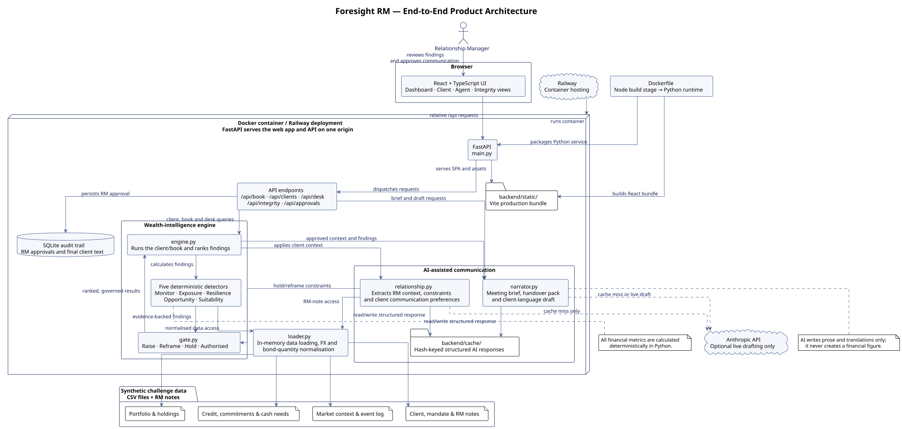

# Foresight RM Architecture

This end-to-end architecture diagram shows how the relationship manager, React interface, FastAPI service, deterministic wealth-intelligence engine, AI-assisted communication layer, source data and deployment workflow fit together.



## Reading the diagram

- **Solid arrows** show application data and request flow.
- **Dashed arrows** show the optional model call, made only on a cache miss or when an RM requests a live client draft.
- **The five deterministic detectors** calculate all portfolio, credit, liquidity and suitability figures from source data.
- **The relationship layer and gate** apply client context before a finding is raised, reframed, held or marked as authorised.
- **The RM remains in control:** client-facing communication needs an RM approval, which is stored in SQLite.

## PlantUML source and regeneration

The editable source is [foresight-rm-architecture.puml](foresight-rm-architecture.puml). The diagram above is the generated SVG file committed alongside it, so it displays directly in Markdown previews and on GitHub.

After changing the PlantUML source, regenerate the image from the repository root:

```bash
plantuml -tsvg docs/foresight-rm-architecture.puml
```

The diagram intentionally reinforces the central product safeguard: **detectors compute, AI narrates, and no AI model originates a financial figure.**
