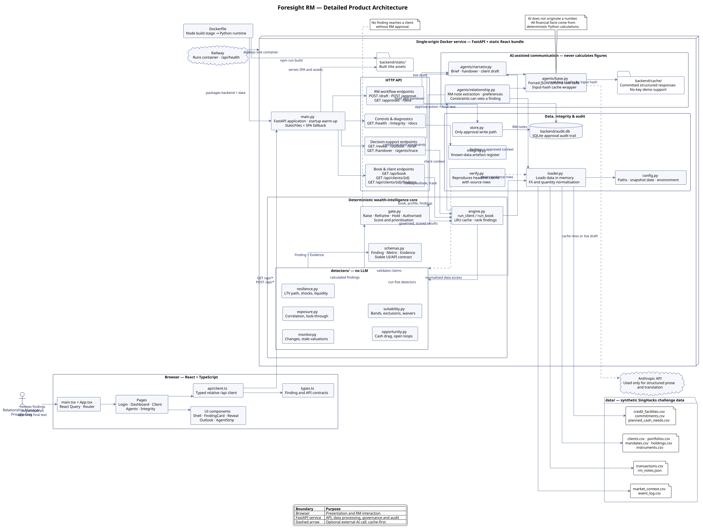

# Foresight RM — Detailed Product Architecture

This is the component-level architecture for Foresight RM. It traces a relationship manager action from the React interface through the FastAPI API, deterministic wealth-intelligence pipeline, relationship-aware governance, AI narration, evidence data and approval audit trail.

[](foresight-rm-detailed-architecture.svg)

Click the diagram to open the full-size SVG and zoom into individual modules.

## Runtime flow

1. A **Relationship Manager** uses the React dashboard, client page and specialist-agent views. `api/client.ts` sends typed requests to relative `/api` endpoints.
2. **FastAPI** serves the built React application and dispatches API calls. At startup, it warms the book-level engine cache.
3. **`engine.py`** runs five deterministic detectors, requests relationship context and ranks the governed findings returned by `gate.py`.
4. **`loader.py`** reads the synthetic portfolio, credit, market, mandate and RM-note data into memory, applying FX and bond-quantity conventions once.
5. The **Gate** receives calculated findings plus client communication constraints. It classifies each result as `raise`, `reframe`, `hold` or `authorised`; no finding is silently dropped.
6. **`narrator.py`** turns governed findings into a meeting brief, handover pack or client-language draft. `agents/base.py` calls the model with forced structured output only after checking the committed hash-keyed cache.
7. The RM reviews and approves a client-facing action. **`store.py`** writes that approval, the model draft and final text to the SQLite audit trail.

## Major component responsibilities

| Area | Key modules | Responsibility |
| --- | --- | --- |
| Frontend | `App.tsx`, `pages/`, `components/`, `api/client.ts` | Relationship-manager interface, typed API consumption and evidence display |
| API | `main.py` | REST endpoints, static-app serving, health check and startup warm-up |
| Intelligence | `engine.py`, `detectors/`, `schemas.py` | Deterministic calculations and an evidence-bearing finding contract |
| Governance | `gate.py`, `agents/relationship.py` | Client-aware prioritisation and suppression/reframing of sensitive findings |
| Communication | `agents/narrator.py`, `agents/base.py`, `cache/` | Cached, schema-bound prose generation; never financial calculation |
| Data quality | `loader.py`, `integrity.py`, `verify.py` | Normalisation, known-data-artefact handling and reproducible evidence |
| Audit | `store.py`, `audit.db` | Persisted RM approvals and final client text |
| Deployment | `Dockerfile`, `railway.json` | One Docker service: Node builds React; Python serves the resulting SPA and API |

## Trust and control boundaries

- **No model originates a financial number.** Detectors calculate all figures from source data in Python.
- **Model calls are cache-first and structured.** Cached responses allow the demo to work without an API key; live calls are limited to narration.
- **The relationship layer can veto a financial finding.** Relationship facts can cause the Gate to hold or reframe an otherwise valid alert.
- **The RM has final authority.** Nothing reaches a client without explicit RM approval, and approvals remain auditable.

## PlantUML source

The editable PlantUML source is [foresight-rm-detailed-architecture.puml](foresight-rm-detailed-architecture.puml). The diagram above is its committed SVG render.

Regenerate it from the repository root after updating the source:

```bash
plantuml -tsvg docs/foresight-rm-detailed-architecture.puml
```
